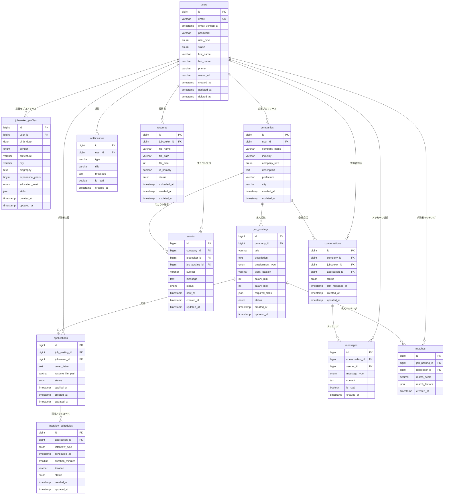

# データベース設計書

求人サイト・マッチングプラットフォームのデータベース設計書です。

## 1. データベース概要

### 1.1 使用技術
- **DBMS**: MySQL 8.0以上
- **文字コード**: utf8mb4
- **照合順序**: utf8mb4_unicode_ci

### 1.2 命名規則
- テーブル名: 複数形、スネークケース（例: `job_postings`）
- カラム名: スネークケース（例: `created_at`）
- 外部キー: `{参照テーブル名}_id`（例: `user_id`）

## 2. テーブル設計

### 2.1 ユーザー関連テーブル

#### users（ユーザー）
```sql
CREATE TABLE users (
    id BIGINT UNSIGNED AUTO_INCREMENT PRIMARY KEY,
    email VARCHAR(255) NOT NULL UNIQUE,
    email_verified_at TIMESTAMP NULL,
    password VARCHAR(255) NOT NULL,
    user_type ENUM('jobseeker', 'company', 'admin') NOT NULL,
    status ENUM('active', 'inactive', 'suspended') DEFAULT 'active',
    first_name VARCHAR(100) NULL,
    last_name VARCHAR(100) NULL,
    phone VARCHAR(20) NULL,
    avatar_url VARCHAR(500) NULL,
    remember_token VARCHAR(100) NULL,
    created_at TIMESTAMP DEFAULT CURRENT_TIMESTAMP,
    updated_at TIMESTAMP DEFAULT CURRENT_TIMESTAMP ON UPDATE CURRENT_TIMESTAMP,
    deleted_at TIMESTAMP NULL,
    
    INDEX idx_email (email),
    INDEX idx_user_type (user_type),
    INDEX idx_status (status)
);
```

#### jobseeker_profiles（求職者プロフィール）
```sql
CREATE TABLE jobseeker_profiles (
    id BIGINT UNSIGNED AUTO_INCREMENT PRIMARY KEY,
    user_id BIGINT UNSIGNED NOT NULL,
    birth_date DATE NULL,
    gender ENUM('male', 'female', 'other', 'prefer_not_to_say') NULL,
    prefecture VARCHAR(50) NULL,
    city VARCHAR(100) NULL,
    address VARCHAR(255) NULL,
    nearest_station VARCHAR(100) NULL,
    biography TEXT NULL,
    experience_years TINYINT UNSIGNED DEFAULT 0,
    education_level ENUM('high_school', 'vocational', 'associate', 'bachelor', 'master', 'doctorate') NULL,
    desired_salary_min INT UNSIGNED NULL,
    desired_salary_max INT UNSIGNED NULL,
    desired_employment_type ENUM('full_time', 'part_time', 'contract', 'freelance') NULL,
    available_start_date DATE NULL,
    skills JSON NULL,
    certifications JSON NULL,
    languages JSON NULL,
    work_location_preference ENUM('office', 'remote', 'hybrid') NULL,
    created_at TIMESTAMP DEFAULT CURRENT_TIMESTAMP,
    updated_at TIMESTAMP DEFAULT CURRENT_TIMESTAMP ON UPDATE CURRENT_TIMESTAMP,
    
    FOREIGN KEY (user_id) REFERENCES users(id) ON DELETE CASCADE,
    INDEX idx_user_id (user_id),
    INDEX idx_prefecture (prefecture),
    INDEX idx_experience_years (experience_years),
    INDEX idx_desired_salary_min (desired_salary_min)
);
```

#### companies（企業）
```sql
CREATE TABLE companies (
    id BIGINT UNSIGNED AUTO_INCREMENT PRIMARY KEY,
    user_id BIGINT UNSIGNED NOT NULL,
    company_name VARCHAR(255) NOT NULL,
    company_name_kana VARCHAR(255) NULL,
    industry VARCHAR(100) NULL,
    company_size ENUM('startup', 'small', 'medium', 'large', 'enterprise') NULL,
    established_year YEAR NULL,
    capital INT UNSIGNED NULL,
    employee_count INT UNSIGNED NULL,
    website_url VARCHAR(500) NULL,
    description TEXT NULL,
    prefecture VARCHAR(50) NULL,
    city VARCHAR(100) NULL,
    address VARCHAR(255) NULL,
    postal_code VARCHAR(10) NULL,
    phone VARCHAR(20) NULL,
    logo_url VARCHAR(500) NULL,
    created_at TIMESTAMP DEFAULT CURRENT_TIMESTAMP,
    updated_at TIMESTAMP DEFAULT CURRENT_TIMESTAMP ON UPDATE CURRENT_TIMESTAMP,
    
    FOREIGN KEY (user_id) REFERENCES users(id) ON DELETE CASCADE,
    INDEX idx_user_id (user_id),
    INDEX idx_company_name (company_name),
    INDEX idx_industry (industry),
    INDEX idx_prefecture (prefecture)
);
```

### 2.2 求人関連テーブル

#### job_postings（求人）
```sql
CREATE TABLE job_postings (
    id BIGINT UNSIGNED AUTO_INCREMENT PRIMARY KEY,
    company_id BIGINT UNSIGNED NOT NULL,
    title VARCHAR(255) NOT NULL,
    description TEXT NOT NULL,
    requirements TEXT NULL,
    benefits TEXT NULL,
    employment_type ENUM('full_time', 'part_time', 'contract', 'freelance') NOT NULL,
    work_location VARCHAR(255) NULL,
    work_location_type ENUM('office', 'remote', 'hybrid') DEFAULT 'office',
    salary_min INT UNSIGNED NULL,
    salary_max INT UNSIGNED NULL,
    salary_type ENUM('monthly', 'annual', 'hourly') DEFAULT 'monthly',
    experience_required TINYINT UNSIGNED DEFAULT 0,
    required_skills JSON NULL,
    preferred_skills JSON NULL,
    education_requirement ENUM('none', 'high_school', 'vocational', 'associate', 'bachelor', 'master', 'doctorate') DEFAULT 'none',
    application_deadline DATE NULL,
    status ENUM('draft', 'published', 'closed', 'archived') DEFAULT 'draft',
    view_count INT UNSIGNED DEFAULT 0,
    application_count INT UNSIGNED DEFAULT 0,
    created_at TIMESTAMP DEFAULT CURRENT_TIMESTAMP,
    updated_at TIMESTAMP DEFAULT CURRENT_TIMESTAMP ON UPDATE CURRENT_TIMESTAMP,
    published_at TIMESTAMP NULL,
    
    FOREIGN KEY (company_id) REFERENCES companies(id) ON DELETE CASCADE,
    INDEX idx_company_id (company_id),
    INDEX idx_status (status),
    INDEX idx_employment_type (employment_type),
    INDEX idx_salary_min (salary_min),
    INDEX idx_experience_required (experience_required),
    INDEX idx_published_at (published_at)
);
```

### 2.3 応募・マッチング関連テーブル

#### applications（応募）
```sql
CREATE TABLE applications (
    id BIGINT UNSIGNED AUTO_INCREMENT PRIMARY KEY,
    job_posting_id BIGINT UNSIGNED NOT NULL,
    jobseeker_id BIGINT UNSIGNED NOT NULL,
    cover_letter TEXT NULL,
    resume_file_path VARCHAR(500) NULL,
    status ENUM('pending', 'reviewing', 'interview_scheduled', 'interview_completed', 'accepted', 'rejected', 'withdrawn') DEFAULT 'pending',
    applied_at TIMESTAMP DEFAULT CURRENT_TIMESTAMP,
    reviewed_at TIMESTAMP NULL,
    interview_scheduled_at TIMESTAMP NULL,
    decision_made_at TIMESTAMP NULL,
    notes TEXT NULL,
    created_at TIMESTAMP DEFAULT CURRENT_TIMESTAMP,
    updated_at TIMESTAMP DEFAULT CURRENT_TIMESTAMP ON UPDATE CURRENT_TIMESTAMP,
    
    FOREIGN KEY (job_posting_id) REFERENCES job_postings(id) ON DELETE CASCADE,
    FOREIGN KEY (jobseeker_id) REFERENCES users(id) ON DELETE CASCADE,
    UNIQUE KEY unique_application (job_posting_id, jobseeker_id),
    INDEX idx_job_posting_id (job_posting_id),
    INDEX idx_jobseeker_id (jobseeker_id),
    INDEX idx_status (status),
    INDEX idx_applied_at (applied_at)
);
```

#### scouts（スカウト）
```sql
CREATE TABLE scouts (
    id BIGINT UNSIGNED AUTO_INCREMENT PRIMARY KEY,
    company_id BIGINT UNSIGNED NOT NULL,
    jobseeker_id BIGINT UNSIGNED NOT NULL,
    job_posting_id BIGINT UNSIGNED NULL,
    subject VARCHAR(255) NOT NULL,
    message TEXT NOT NULL,
    status ENUM('sent', 'read', 'replied', 'ignored', 'accepted', 'declined') DEFAULT 'sent',
    sent_at TIMESTAMP DEFAULT CURRENT_TIMESTAMP,
    read_at TIMESTAMP NULL,
    replied_at TIMESTAMP NULL,
    created_at TIMESTAMP DEFAULT CURRENT_TIMESTAMP,
    updated_at TIMESTAMP DEFAULT CURRENT_TIMESTAMP ON UPDATE CURRENT_TIMESTAMP,
    
    FOREIGN KEY (company_id) REFERENCES companies(id) ON DELETE CASCADE,
    FOREIGN KEY (jobseeker_id) REFERENCES users(id) ON DELETE CASCADE,
    FOREIGN KEY (job_posting_id) REFERENCES job_postings(id) ON DELETE SET NULL,
    INDEX idx_company_id (company_id),
    INDEX idx_jobseeker_id (jobseeker_id),
    INDEX idx_status (status),
    INDEX idx_sent_at (sent_at)
);
```

#### matches（マッチング）
```sql
CREATE TABLE matches (
    id BIGINT UNSIGNED AUTO_INCREMENT PRIMARY KEY,
    job_posting_id BIGINT UNSIGNED NOT NULL,
    jobseeker_id BIGINT UNSIGNED NOT NULL,
    match_score DECIMAL(5,2) NOT NULL,
    match_factors JSON NULL,
    created_at TIMESTAMP DEFAULT CURRENT_TIMESTAMP,
    
    FOREIGN KEY (job_posting_id) REFERENCES job_postings(id) ON DELETE CASCADE,
    FOREIGN KEY (jobseeker_id) REFERENCES users(id) ON DELETE CASCADE,
    UNIQUE KEY unique_match (job_posting_id, jobseeker_id),
    INDEX idx_job_posting_id (job_posting_id),
    INDEX idx_jobseeker_id (jobseeker_id),
    INDEX idx_match_score (match_score)
);
```

### 2.4 メッセージング関連テーブル

#### conversations（会話）
```sql
CREATE TABLE conversations (
    id BIGINT UNSIGNED AUTO_INCREMENT PRIMARY KEY,
    company_id BIGINT UNSIGNED NOT NULL,
    jobseeker_id BIGINT UNSIGNED NOT NULL,
    application_id BIGINT UNSIGNED NULL,
    scout_id BIGINT UNSIGNED NULL,
    status ENUM('active', 'archived', 'blocked') DEFAULT 'active',
    last_message_at TIMESTAMP NULL,
    created_at TIMESTAMP DEFAULT CURRENT_TIMESTAMP,
    updated_at TIMESTAMP DEFAULT CURRENT_TIMESTAMP ON UPDATE CURRENT_TIMESTAMP,
    
    FOREIGN KEY (company_id) REFERENCES companies(id) ON DELETE CASCADE,
    FOREIGN KEY (jobseeker_id) REFERENCES users(id) ON DELETE CASCADE,
    FOREIGN KEY (application_id) REFERENCES applications(id) ON DELETE SET NULL,
    FOREIGN KEY (scout_id) REFERENCES scouts(id) ON DELETE SET NULL,
    UNIQUE KEY unique_conversation (company_id, jobseeker_id),
    INDEX idx_company_id (company_id),
    INDEX idx_jobseeker_id (jobseeker_id),
    INDEX idx_last_message_at (last_message_at)
);
```

#### messages（メッセージ）
```sql
CREATE TABLE messages (
    id BIGINT UNSIGNED AUTO_INCREMENT PRIMARY KEY,
    conversation_id BIGINT UNSIGNED NOT NULL,
    sender_id BIGINT UNSIGNED NOT NULL,
    message_type ENUM('text', 'file', 'system') DEFAULT 'text',
    content TEXT NULL,
    file_path VARCHAR(500) NULL,
    file_name VARCHAR(255) NULL,
    file_size INT UNSIGNED NULL,
    is_read BOOLEAN DEFAULT FALSE,
    read_at TIMESTAMP NULL,
    created_at TIMESTAMP DEFAULT CURRENT_TIMESTAMP,
    
    FOREIGN KEY (conversation_id) REFERENCES conversations(id) ON DELETE CASCADE,
    FOREIGN KEY (sender_id) REFERENCES users(id) ON DELETE CASCADE,
    INDEX idx_conversation_id (conversation_id),
    INDEX idx_sender_id (sender_id),
    INDEX idx_created_at (created_at),
    INDEX idx_is_read (is_read)
);
```

### 2.5 通知関連テーブル

#### notifications（通知）
```sql
CREATE TABLE notifications (
    id BIGINT UNSIGNED AUTO_INCREMENT PRIMARY KEY,
    user_id BIGINT UNSIGNED NOT NULL,
    type VARCHAR(100) NOT NULL,
    title VARCHAR(255) NOT NULL,
    message TEXT NOT NULL,
    data JSON NULL,
    is_read BOOLEAN DEFAULT FALSE,
    read_at TIMESTAMP NULL,
    created_at TIMESTAMP DEFAULT CURRENT_TIMESTAMP,
    
    FOREIGN KEY (user_id) REFERENCES users(id) ON DELETE CASCADE,
    INDEX idx_user_id (user_id),
    INDEX idx_type (type),
    INDEX idx_is_read (is_read),
    INDEX idx_created_at (created_at)
);
```

### 2.6 履歴書関連テーブル

#### resumes（履歴書）
```sql
CREATE TABLE resumes (
    id BIGINT UNSIGNED AUTO_INCREMENT PRIMARY KEY,
    jobseeker_id BIGINT UNSIGNED NOT NULL,
    file_name VARCHAR(255) NOT NULL,
    original_name VARCHAR(255) NOT NULL,
    file_path VARCHAR(500) NOT NULL,
    file_size INT UNSIGNED NOT NULL,
    mime_type VARCHAR(100) NOT NULL,
    version TINYINT UNSIGNED DEFAULT 1,
    is_primary BOOLEAN DEFAULT FALSE,
    status ENUM('uploading', 'scanning', 'approved', 'rejected') DEFAULT 'uploading',
    uploaded_at TIMESTAMP DEFAULT CURRENT_TIMESTAMP,
    created_at TIMESTAMP DEFAULT CURRENT_TIMESTAMP,
    updated_at TIMESTAMP DEFAULT CURRENT_TIMESTAMP ON UPDATE CURRENT_TIMESTAMP,
    
    FOREIGN KEY (jobseeker_id) REFERENCES users(id) ON DELETE CASCADE,
    INDEX idx_jobseeker_id (jobseeker_id),
    INDEX idx_is_primary (is_primary),
    INDEX idx_status (status),
    INDEX idx_uploaded_at (uploaded_at)
);
```

### 2.7 面接スケジュール関連テーブル

#### interview_schedules（面接スケジュール）
```sql
CREATE TABLE interview_schedules (
    id BIGINT UNSIGNED AUTO_INCREMENT PRIMARY KEY,
    application_id BIGINT UNSIGNED NOT NULL,
    interview_type ENUM('online', 'onsite', 'phone') NOT NULL,
    scheduled_at TIMESTAMP NOT NULL,
    duration_minutes SMALLINT UNSIGNED DEFAULT 60,
    location VARCHAR(255) NULL,
    meeting_url VARCHAR(500) NULL,
    notes TEXT NULL,
    status ENUM('scheduled', 'confirmed', 'completed', 'cancelled', 'rescheduled') DEFAULT 'scheduled',
    created_by BIGINT UNSIGNED NOT NULL,
    created_at TIMESTAMP DEFAULT CURRENT_TIMESTAMP,
    updated_at TIMESTAMP DEFAULT CURRENT_TIMESTAMP ON UPDATE CURRENT_TIMESTAMP,
    
    FOREIGN KEY (application_id) REFERENCES applications(id) ON DELETE CASCADE,
    FOREIGN KEY (created_by) REFERENCES users(id) ON DELETE CASCADE,
    INDEX idx_application_id (application_id),
    INDEX idx_scheduled_at (scheduled_at),
    INDEX idx_status (status)
);
```

## 3. ER図



## 4. インデックス戦略

### 4.1 検索性能向上のためのインデックス
- 求人検索: `job_postings(status, employment_type, salary_min, experience_required)`
- ユーザー検索: `users(user_type, status)`
- メッセージ検索: `messages(conversation_id, created_at)`

### 4.2 複合インデックス
```sql
-- 求人検索用複合インデックス
CREATE INDEX idx_job_search ON job_postings(status, employment_type, salary_min, experience_required);

-- 応募管理用複合インデックス
CREATE INDEX idx_application_management ON applications(job_posting_id, status, applied_at);

-- メッセージ履歴用複合インデックス
CREATE INDEX idx_message_history ON messages(conversation_id, created_at DESC);
```

## 5. パフォーマンス考慮事項

### 5.1 データ分散
- 大量のメッセージデータは別テーブルまたはパーティショニング検討
- ファイルストレージはAWS S3等の外部ストレージを使用

### 5.2 キャッシュ戦略
- 求人検索結果のキャッシュ（Redis）
- ユーザーセッション情報のキャッシュ
- 通知件数のキャッシュ

## 6. セキュリティ考慮事項

### 6.1 データ暗号化
- パスワードのハッシュ化（bcrypt）
- 個人情報の暗号化（AES-256）

### 6.2 アクセス制御
- 行レベルセキュリティの実装
- 個人情報へのアクセスログ記録

---
*このデータベース設計書は要件定義書（[requirements.md](./requirements.md)）と画面遷移図（[screen-transition-diagram.md](./screen-transition-diagram.md)）に基づいて作成されています。*
