# 画面遷移図

求人サイト・マッチングプラットフォームの画面遷移図をMermaid形式で記述しています。

## 画面遷移図

```mermaid
graph TD
    %% スタートポイント
    START([サイトアクセス]) --> TOP[トップページ]
    
    %% 認証関連
    TOP --> LOGIN[ログイン画面]
    TOP --> REGISTER[ユーザー登録画面]
    LOGIN --> FORGOT[パスワードリセット]
    REGISTER --> VERIFY[メール認証画面]
    
    %% ユーザータイプ分岐
    LOGIN --> JOBSEEKER_DASH[求職者ダッシュボード]
    LOGIN --> COMPANY_DASH[企業ダッシュボード]
    LOGIN --> ADMIN_DASH[管理者ダッシュボード]
    VERIFY --> JOBSEEKER_DASH
    VERIFY --> COMPANY_DASH
    
    %% 求職者系画面
    JOBSEEKER_DASH --> JS_PROFILE[プロフィール編集]
    JOBSEEKER_DASH --> JOB_SEARCH[求人検索]
    JOBSEEKER_DASH --> APPLICATION_HISTORY[応募履歴]
    JOBSEEKER_DASH --> JS_MESSAGES[メッセージ一覧]
    JOBSEEKER_DASH --> RESUME_MANAGE[履歴書管理]
    JOBSEEKER_DASH --> NOTIFICATIONS[通知一覧]
    
    JOB_SEARCH --> JOB_DETAIL[求人詳細]
    JOB_DETAIL --> APPLICATION[応募画面]
    APPLICATION --> APPLICATION_HISTORY
    
    RESUME_MANAGE --> RESUME_UPLOAD[履歴書アップロード]
    RESUME_MANAGE --> RESUME_PREVIEW[履歴書プレビュー]
    
    JS_MESSAGES --> CHAT[チャット画面]
    APPLICATION_HISTORY --> CHAT
    
    %% 企業系画面
    COMPANY_DASH --> COMP_PROFILE[会社プロフィール編集]
    COMPANY_DASH --> JOB_POST[求人投稿]
    COMPANY_DASH --> JOB_MANAGE[求人管理]
    COMPANY_DASH --> CANDIDATE_SEARCH[求職者検索]
    COMPANY_DASH --> APPLICATION_MANAGE[応募管理]
    COMPANY_DASH --> COMP_MESSAGES[メッセージ一覧]
    COMPANY_DASH --> INTERVIEW_SCHEDULE[面接スケジュール]
    
    JOB_POST --> JOB_MANAGE
    CANDIDATE_SEARCH --> CANDIDATE_DETAIL[求職者詳細]
    CANDIDATE_DETAIL --> SCOUT[スカウト送信]
    APPLICATION_MANAGE --> CANDIDATE_DETAIL
    
    COMP_MESSAGES --> CHAT
    SCOUT --> COMP_MESSAGES
    APPLICATION_MANAGE --> INTERVIEW_SCHEDULE
    
    %% 管理者系画面
    ADMIN_DASH --> USER_MANAGE[ユーザー管理]
    ADMIN_DASH --> COMPANY_MANAGE[企業管理]
    ADMIN_DASH --> ADMIN_JOB_MANAGE[求人管理]
    ADMIN_DASH --> SYSTEM_SETTINGS[システム設定]
    ADMIN_DASH --> REPORTS[レポート]
    
    %% 共通機能
    JOBSEEKER_DASH --> LOGOUT[ログアウト]
    COMPANY_DASH --> LOGOUT
    ADMIN_DASH --> LOGOUT
    LOGOUT --> TOP
    
    %% マッチング機能
    JOBSEEKER_DASH --> MATCHES[マッチング一覧]
    COMPANY_DASH --> MATCHES
    MATCHES --> CANDIDATE_DETAIL
    MATCHES --> JOB_DETAIL
    
    %% 通知からの遷移
    NOTIFICATIONS --> JOB_DETAIL
    NOTIFICATIONS --> CHAT
    NOTIFICATIONS --> APPLICATION_HISTORY
    
    %% スタイリング
    classDef authPages fill:#e1f5fe
    classDef jobseekerPages fill:#f3e5f5
    classDef companyPages fill:#e8f5e8
    classDef adminPages fill:#fff3e0
    classDef commonPages fill:#f5f5f5
    
    class LOGIN,REGISTER,VERIFY,FORGOT authPages
    class JOBSEEKER_DASH,JS_PROFILE,JOB_SEARCH,JOB_DETAIL,APPLICATION,APPLICATION_HISTORY,JS_MESSAGES,RESUME_MANAGE,RESUME_UPLOAD,RESUME_PREVIEW jobseekerPages
    class COMPANY_DASH,COMP_PROFILE,JOB_POST,JOB_MANAGE,CANDIDATE_SEARCH,CANDIDATE_DETAIL,SCOUT,APPLICATION_MANAGE,COMP_MESSAGES,INTERVIEW_SCHEDULE companyPages
    class ADMIN_DASH,USER_MANAGE,COMPANY_MANAGE,ADMIN_JOB_MANAGE,SYSTEM_SETTINGS,REPORTS adminPages
    class TOP,CHAT,MATCHES,NOTIFICATIONS,LOGOUT commonPages
```

## 画面説明

### 認証・ユーザー管理画面
- **トップページ**: サイトのランディングページ
- **ログイン画面**: ユーザー認証
- **ユーザー登録画面**: 新規ユーザー登録
- **メール認証画面**: 登録時のメール認証
- **パスワードリセット**: パスワード忘れ時の再設定

### 求職者向け画面
- **求職者ダッシュボード**: 求職者のメインページ（マッチング情報、通知等）
- **プロフィール編集**: スキル、経験、希望条件の編集
- **求人検索**: 条件に基づく求人検索
- **求人詳細**: 個別求人の詳細情報表示
- **応募画面**: 求人への応募処理
- **応募履歴**: 過去の応募状況確認
- **メッセージ一覧**: 企業からのメッセージ管理
- **履歴書管理**: PDF履歴書の管理機能
- **履歴書アップロード**: PDF履歴書のアップロード
- **履歴書プレビュー**: アップロード済み履歴書の確認

### 企業向け画面
- **企業ダッシュボード**: 企業のメインページ
- **会社プロフィール編集**: 企業情報の編集
- **求人投稿**: 新規求人の投稿
- **求人管理**: 投稿済み求人の管理
- **求職者検索**: 条件に基づく求職者検索
- **求職者詳細**: 個別求職者の詳細情報
- **スカウト送信**: 求職者へのスカウト機能
- **応募管理**: 応募者の管理
- **面接スケジュール**: 面接日程の調整

### 管理者向け画面
- **管理者ダッシュボード**: システム管理者のメインページ
- **ユーザー管理**: 登録ユーザーの管理
- **企業管理**: 登録企業の管理
- **求人管理**: 全求人の管理
- **システム設定**: システム全体の設定
- **レポート**: 各種統計・分析レポート

### 共通機能画面
- **チャット画面**: リアルタイムメッセージング
- **マッチング一覧**: AI自動マッチング結果表示
- **通知一覧**: システム通知の確認

## 色分け凡例
- **水色**: 認証・ユーザー管理関連画面
- **紫色**: 求職者向け画面
- **緑色**: 企業向け画面
- **オレンジ色**: 管理者向け画面
- **グレー**: 共通機能画面

---
*この画面遷移図は要件定義書（requirements.md）に基づいて作成されています。*
